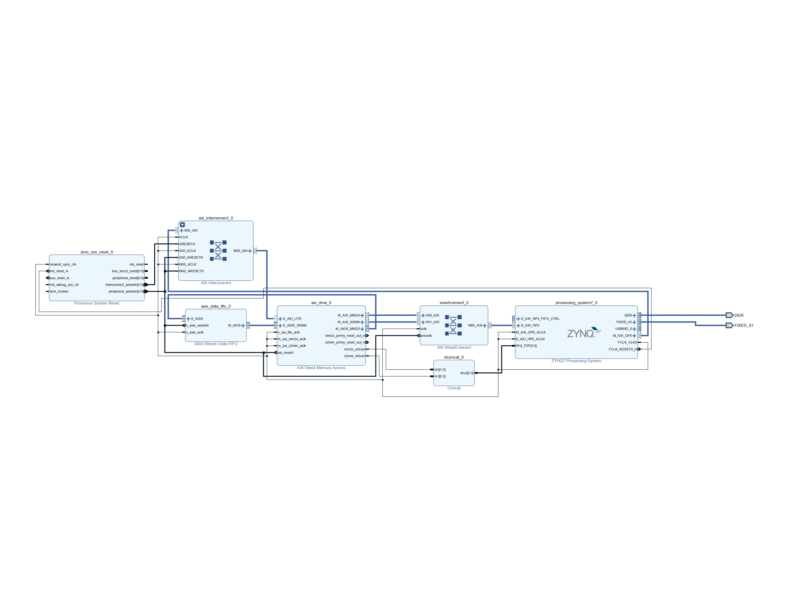
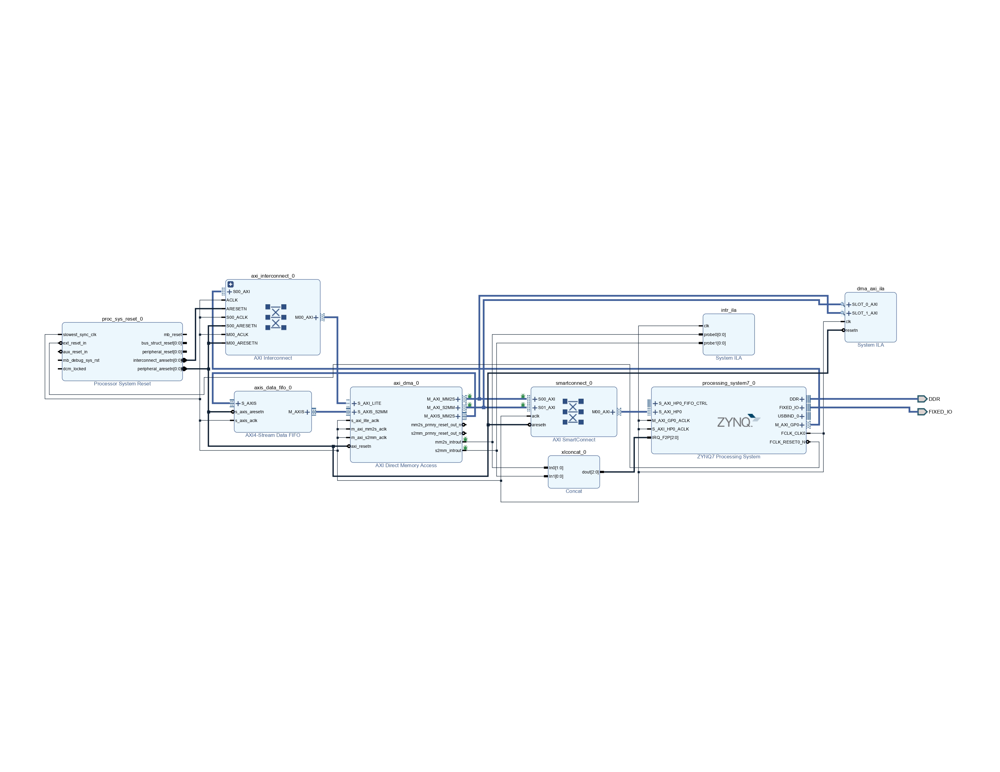
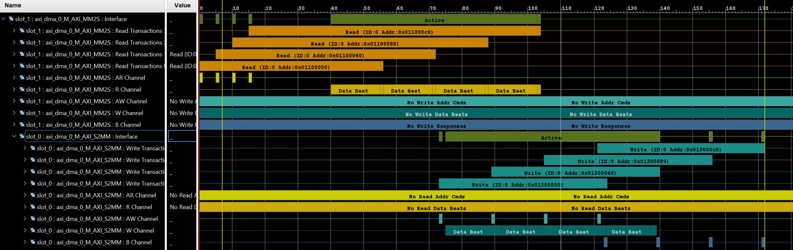
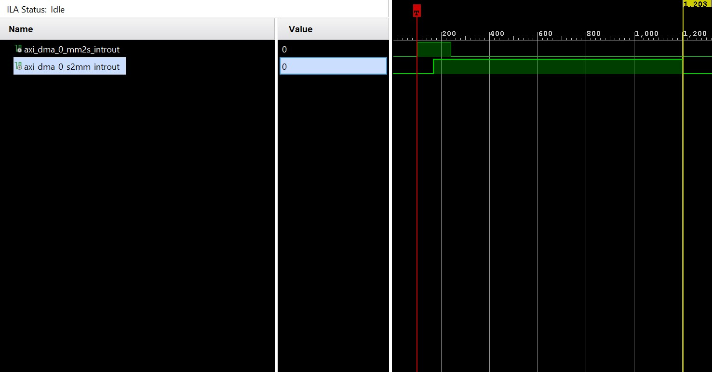

# Direct Memory Access via High Performance AXI Slave Port

## Summary

This guide builds upon the [Simple Polling DMA](https://github.com/BekdoucheAmine/axi-dma-sp-cora-z7-07s) setup by integrating interrupts. This transitions the system from a "wait-and-watch" approach to an event-driven one, freeing the CPU to execute other tasks while the hardware handles data movement.

## Table of Content

- Introduction
- Materials
- Methodology
    - Hardware
        - DMA Interrupt Architecture
        - Debug Setup
    - Software
        - Interrupt Implementation
- Results
    - Logic Inspection
    - Serial Output

## Introduction

In high-performance embedded systems, data movement efficiency is critical. On the Zynq-7000 architecture, the AXI High-Performance (HP) Slave ports provide a dedicated, low-latency path between the Programmable Logic (PL) and the DDR controller. This guide demonstrates how to use interrupts to notify the processor when a transfer is complete, eliminating the need for CPU-intensive polling loops.

## Materials

1. [Cora Z7-07S (Zynq-7000)](https://digilent.com/shop/cora-z7-zynq-7000-single-core-for-arm-fpga-soc-development/)
2. [Xilinx Design Pack 2018.3 (Vivado+SDK)](https://www.xilinx.com/support/download/index.html/content/xilinx/en/downloadNav/vivado-design-tools/archive.html)
3. [Tera Term](https://github.com/TeraTermProject/teraterm/releases) for serial monitoring

## Methodology

### Hardware

If you haven't completed the basic setup, refer to the [Simple Polling Arch](https://github.com/BekdoucheAmine/axi-dma-sp-cora-z7-07s) guide first.

#### DMA Interrupt Architecture



**1- Enable Interrupts:** In the *Zynq Processing System IP* block, enable the *Fabric Interrupts (IRQ_F2P)*.

**2- Concatenation:** Since the *AXI DMA* provides two interrupt signals (*MM2S* and *S2MM*), add a *Concat IP* block.

**3- Routing:** Map both *DMA* interrupt lines to the *Concat* input, and connect the output to the *Zynq IRQ_F2P* port.

**4- Generate:** Validate the design, create the *HDL* wrapper, and generate the bit-stream.

### Debug Setup



Interrupts trigger in microseconds, making them impossible to track via serial logs alone. To see what’s happening "under the hood," we use the *Integrated Logic Analyzer (ILA)*.

- **Adding Probes:** You can manually add *ILA* blocks or right-click the interrupt wires and the *AXI Stream* interfaces and select *Debug*.

- **Connection Automation:** Run Connection Automation to let *Vivado* wire the debug hub and clocks.

- **Pro Tip:** Set your *ILA* trigger depth to at least 2048 samples. Because the FPGA is so fast, both interrupts (*Read* and *Write*) will often rise before the *CPU* can de-assert either one. You will notice the second interrupt stays high for a "long" time—this is the latency of the *CPU* executing the first *Interrupt Service Routine (ISR)*.

### Software

#### Interrupt Implementation

The software transition from polling to interrupts requires three main steps: initializing the *GIC (Generic Interrupt Controller)*, linking your handlers, and enabling the *DMA IRQs*.

**1. Enable DMA Interrupts**

After initializing the *DMA* hardware, tell the *IP* which events should trigger a signal.

```c
    // Enable both Complete and Error interrupts for both channels
    XAxiDma_IntrEnable(&AxiDma, XAXIDMA_IRQ_ALL_MASK,XAXIDMA_DEVICE_TO_DMA);
    XAxiDma_IntrEnable(&AxiDma, XAXIDMA_IRQ_ALL_MASK,XAXIDMA_DMA_TO_DEVICE);	
```
**3. Setup the Interrupt System**
You must register the *DMA* as a source within the *Zynq*'s Exception Table.

```c
static int SetupIntrSystem(INTC * IntcInstancePtr, XAxiDma * AxiDmaPtr, u16 TxIntrId, u16 RxIntrId)
{
    // 1. Initialize Interrupt Controller
    XIntc_Initialize(IntcInstancePtr, INTC_DEVICE_ID);

    // 2. Connect Handlers (Callback functions)
    XIntc_Connect(IntcInstancePtr, TxIntrId, (XInterruptHandler) TxIntrHandler, AxiDmaPtr);
    XIntc_Connect(IntcInstancePtr, RxIntrId, (XInterruptHandler) RxIntrHandler, AxiDmaPtr);

    // 3. Start GIC and enable specific hardware lines
    XIntc_Start(IntcInstancePtr, XIN_REAL_MODE);
    XIntc_Enable(IntcInstancePtr, TxIntrId);
    XIntc_Enable(IntcInstancePtr, RxIntrId);

    // 4. Initialize Hardware Exceptions
    Xil_ExceptionInit();
    Xil_ExceptionRegisterHandler(XIL_EXCEPTION_ID_INT, (Xil_ExceptionHandler)INTC_HANDLER, IntcInstancePtr);
    Xil_ExceptionEnable();

    return XST_SUCCESS;
}
```
**3. Initiate Transfer and Wait**
Instead of polling a register, we now wait for flags set by the *ISRs*.
```c
    // S2MM: Device to DMA (Memory)
    Status = XAxiDma_SimpleTransfer(&AxiDma,(UINTPTR) RxBufferPtr,
                                    MAX_PKT_LEN, XAXIDMA_DEVICE_TO_DMA);
    // MM2S: DMA (Memory) to Device
    Status = XAxiDma_SimpleTransfer(&AxiDma,(UINTPTR) TxBufferPtr,
                                    MAX_PKT_LEN, XAXIDMA_DMA_TO_DEVICE);
    // Feel free to perform other tasks here
    // TxDone, RxDone are variables used to affirm that interrupt occurred
    while ((!TxDone || !RxDone) && !Error) {
            /* NOP */
    }
```

**4. Interrupt Service Routine**
The following handler manages the **MM2S** channel. A nearly identical function is used for the **S2MM** channel, substituting the appropriate direction constants and flags.

```c
static void TxIntrHandler(void *Callback)
{
	u32 IrqStatus;
	int TimeOut;
	XAxiDma *AxiDmaInst = (XAxiDma *)Callback;

	/* 1. Identify the Interrupt Source */
	IrqStatus = XAxiDma_IntrGetIrq(AxiDmaInst, XAXIDMA_DMA_TO_DEVICE);

	/* 2. Acknowledge and Clear */
	// It is vital to acknowledge the interrupt immediately to clear 
	// the hardware latch and prepare for the next event.
	XAxiDma_IntrAckIrq(AxiDmaInst, IrqStatus, XAXIDMA_DMA_TO_DEVICE);

	/* 3. Filter Spurious Interrupts */
	if (!(IrqStatus & XAXIDMA_IRQ_ALL_MASK)) {
		return;
	}

	/* 4. Error Recovery Logic */
	// If the Error mask is set, the DMA engine has halted. 
	// We set a global error flag and initiate a hardware reset.
	if ((IrqStatus & XAXIDMA_IRQ_ERROR_MASK)) {
		Error = 1;
		XAxiDma_Reset(AxiDmaInst);
		TimeOut = RESET_TIMEOUT_COUNTER;

		while (TimeOut) {
			if (XAxiDma_ResetIsDone(AxiDmaInst)) {
				break;
			}
			TimeOut -= 1;
		}
		return;
	}

	/* 5. Completion Assertion */
	// XAXIDMA_IRQ_IOC_MASK indicates "Interrupt on Complete."
	// We set the volatile TxDone flag to notify the main-line code.
	if ((IrqStatus & XAXIDMA_IRQ_IOC_MASK)) {
		xil_printf("---- MM2S Interrupt is Active  ---- \r\n");
		TxDone = 1;
	}
}
```
- **The Callback Pointer**

The function signature uses *void \*Callback*. During the *XIntc_Connect* step in our setup, we passed the address of our *DMA* instance (*&AxiDma*). In the handler, we cast this back to an *XAxiDma* pointer. This is what allows the *ISR* to "talk" to the specific hardware instance that triggered the event, enabling it to read registers or trigger a reset.

- **The Interrupt Acknowledge (Ack)**

Calling *XAxiDma_IntrAckIrq* is perhaps the most important line in the handler. This function tells the hardware: "I have seen this interrupt, you can stop signaling now." 

**Warning: If you fail to acknowledge the interrupt, the FPGA will keep the interrupt line high. The CPU will exit the ISR and immediately jump back into it because it thinks a new event has occurred, resulting in an infinite loop where your main program never resumes.**

- **The volatile Keyword**

The variables used to signal completion (e.g., *TxDone*, *RxDone*, and *Error*) must be declared with the volatile qualifier in your global scope:
```c
volatile int TxDone = 0;
volatile int RxDone = 0;
volatile int Error = 0;
```

Without volatile, the compiler's optimizer might look at your *while(!TxDone)* loop and assume *TxDone* never changes because there is no code inside the loop that modifies it. The compiler might then optimize the loop into an infinite *jump-to-self*, ignoring the fact that the *ISR* modifies that memory location in the background.

- **ISR Latency and xil_printf**

In this guide, we use *xil_printf* inside the *ISR* to provide visual feedback that the interrupt triggered. However, in high-performance or production environments, avoid this.

Printing to a serial console is a slow, blocking operation.

While the *CPU* is busy printing **"MM2S Interrupt is Active"**, it cannot handle other interrupts.

For time-critical applications, keep your ISRs *lean and mean*, simply set a flag or increment a counter and exit.

## Results

### Logic Inspection

- **Axi DMA**



Using the *ILA*, we can see that each read/write is processed in bursts of 16 (the default for the *AXI DMA IP*). With a total of 256 transactions, the hardware efficiently saturates the bus. 

**Notably, the MM2S (Read) is initiated slightly before the S2MM (Write) because our loopback FIFO needs data to be present before it can push it back. Check the [C source file](software-src/dma_hp_intr.c).**

- **Interrupts**
 


The *ILA* reveals a critical timing detail: the *MM2S (Read)* finishes first. However, the *S2MM (Write)* interrupt remains asserted for a significantly longer duration.

**Why? This isn't a hardware bottleneck. It's the "Software Latency." The CPU is busy executing the TxIntrHandler. It only clears the second interrupt after it finishes the first one, illustrating the overhead of context switching in an OS-less (Baremetal) environment.**

### Serial Output

```
---- Entering main() ---
---- MM2S Interrupt is Active  ----
---- S2MM Interrupt is Active ----
Data valid 0: sent C = received C PASS
Data valid 1: sent D = received D PASS
Data valid 2: sent E = received E PASS
Data valid 3: sent F = received F PASS
Data valid 4: sent 10 = received 10 PASS
Data valid 5: sent 11 = received 11 PASS
...
Data valid 251: sent 7 = received 7 PASS
Data valid 252: sent 8 = received 8 PASS
Data valid 253: sent 9 = received 9 PASS
Data valid 254: sent A = received A PASS
Data valid 255: sent B = received B PASS
Successfully ran AXI DMA interrupt Example
---- Exiting main() ---
```